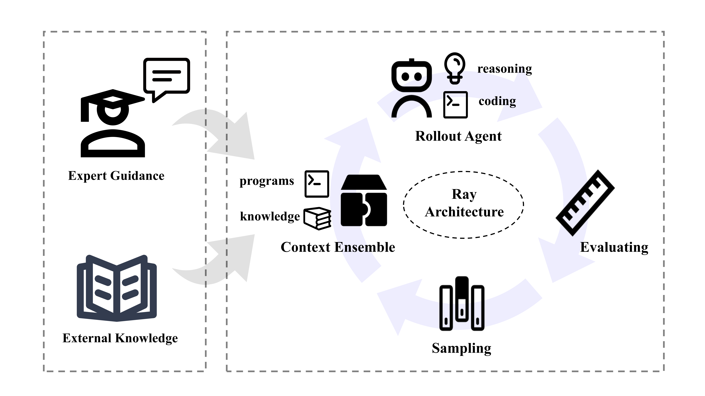
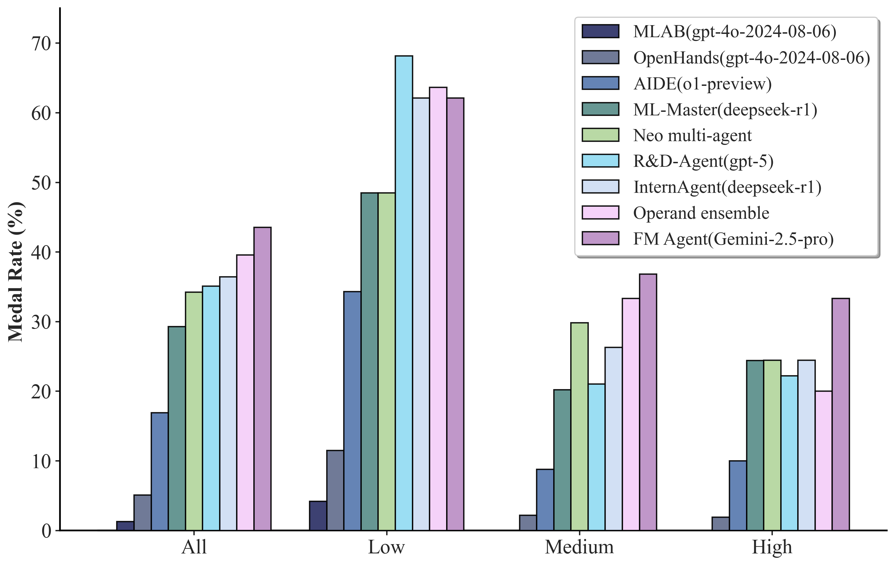
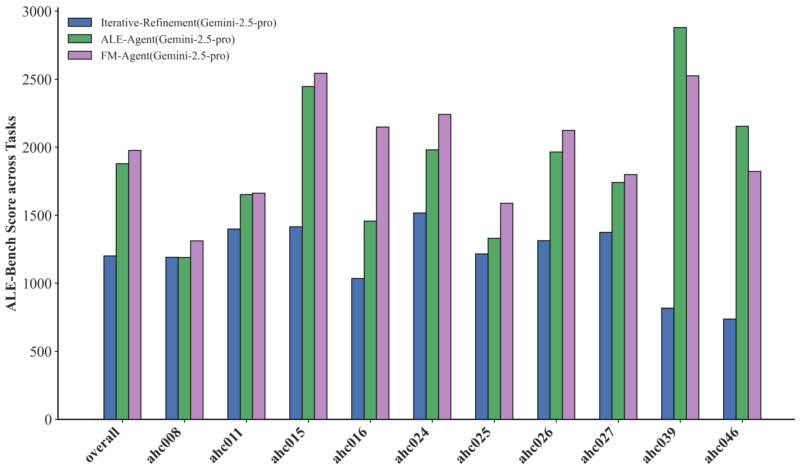

<div align="right">
  <a href="README_CN.md">简体中文</a> | <b>English</b>
</div>

<h1 align="center">FM Agent</h1>

<div align="center">

📄 **[Tech Report](https://github.com/baidubce/FM-Agent/blob/main/docs/FMAgent_TechReport.pdf)** |
<a href="https://cloud.baidu.com/" style="vertical-align:middle;"> **Baidu AI Cloud**</a> | 
📌  <a href="https://arxiv.org/pdf/2510.26144" style="vertical-align:middle;">al-align:middle;" **Arxiv**</a> |
🚩 <a href="https://cloud.baidu.com/product/famou.html" style="vertical-align:middle;">al-align:middle;" **Official Website**</a> 
</div>


<p align="center">
  
</p>
 
## Introduction
FM Agent is a novel, general-purpose multi-agent framework that addresses complex real-world challenges by synergistically combining LLM-based reasoning and large-scale evolutionary search. Demonstrating broad applicability, our system has been evaluated across diverse domains, including operations research, machine learning, GPU kernel optimization, and classical mathematical problems.


## Technical Advantages
### ❄️ Cold-Start Initialization
This phase integrates  diverse generation agents to produce a broad yet high-quality initial solution space. Moreover, with an optional expert-in-the-loop design, the framework ensures evolutionary search begins from a pragmatically grounded foundation, significantly accelerating convergence, especially in some real-world complex cases.

### 🧬 Adaptive Diversity-Driven Sampling
Our novel sampling strategy orchestrates multiple parallel evolutionary islands, adaptively balancing exploration and exploitation through dynamic resource allocation. This mechanism maintains productive diversity across algorithmic lineages while systematically steering the population toward global optima.

### 🎯 Domain-Specific Evaluation
Custom evaluators synthesize multiple critical criteria—including functional correctness, operational effectiveness, and LLM-supervised quality assessment—to generate nuanced, multi-faceted feedback. This comprehensive scoring mechanism provides rich, cumulative signals that precisely guide the iterative refinement process.

### 🚀 Distributed Asynchronous Infrastructure
Built on Ray, our scalable orchestration framework enables fine-grained, large-scale concurrent evaluation across distributed computing resources. This architecture ensures efficient resource utilization while facilitating rapid and systematic exploration of complex, high-dimensional solution spaces.
  
## Performance Metrics
FM Agent reaches state-of-the-art results autonomously, without human interpretation or tuning — **1976.3** on ALE-Bench (+5.2%), **43.56**% on MLE-bench (+4.0pp), up to **20×** speedups on KernelBench, and establishes new state-of-the-art(SOTA) results on several classical mathematical problems.

### MLE-bench
💥💥💥FM Agent is currently ranked first on the [MLE-bench Leaderboard](https://github.com/openai/mle-bench?tab=readme-ov-file).
<p align="center">
  
</p>


### ALE-Bench
<p align="center">
  
</p>


### KernelBench
<p align="center">
  
</p>

## Citation

If you use FM Agent in your research, please cite:

```bibtex
@misc{li2025fmagent,
      title={The FM Agent}, 
      author={Annan Li and Chufan Wu and Zengle Ge and Yee Hin Chong and Zhinan Hou and Lizhe Cao and Cheng Ju and Jianmin Wu and Huaiming Li and Haobo Zhang and Shenghao Feng and Mo Zhao and Fengzhi Qiu and Rui Yang and Mengmeng Zhang and Wenyi Zhu and Yingying Sun and Quan Sun and Shunhao Yan and Danyu Liu and Dawei Yin and Dou Shen},
      year={2025},
      eprint={2510.26144},
      archivePrefix={arXiv},
      primaryClass={cs.AI},
      url={https://arxiv.org/abs/2510.26144}, 
}
```

## License

This project is licensed under the MIT License. See the [LICENSE](LICENSE) file for details.

## Contact Us

- GitHub Issues: [Submit Issue](https://github.com/baidubce/FM-Agent/issues)

---
