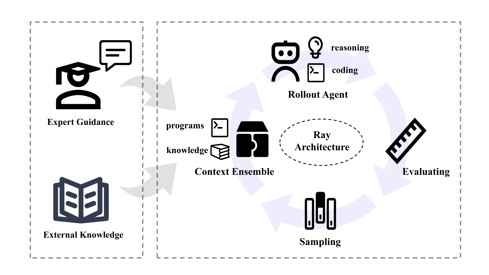
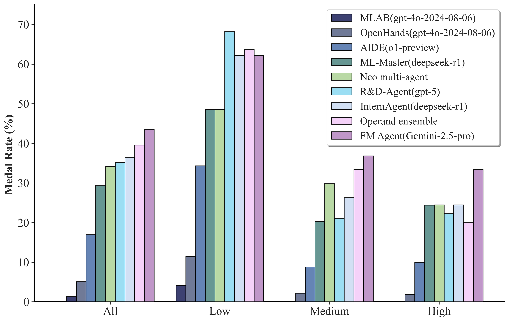
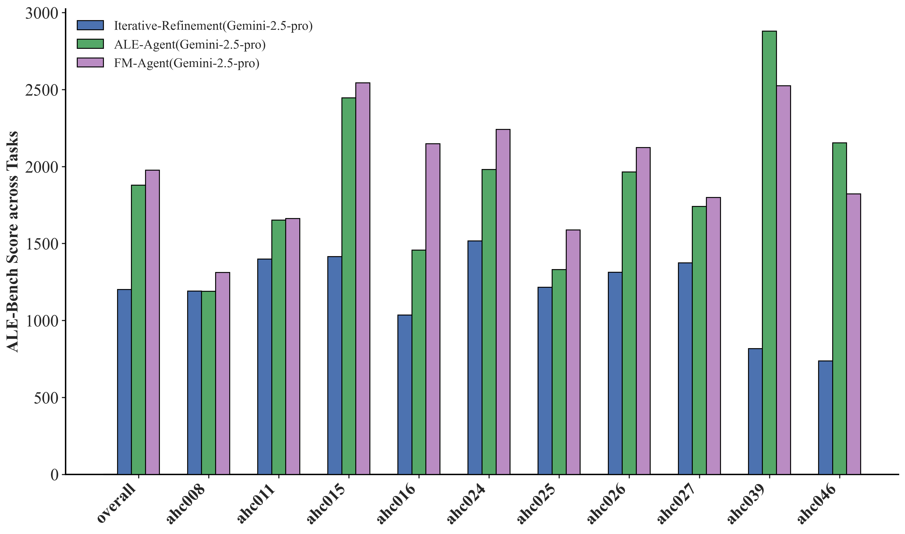
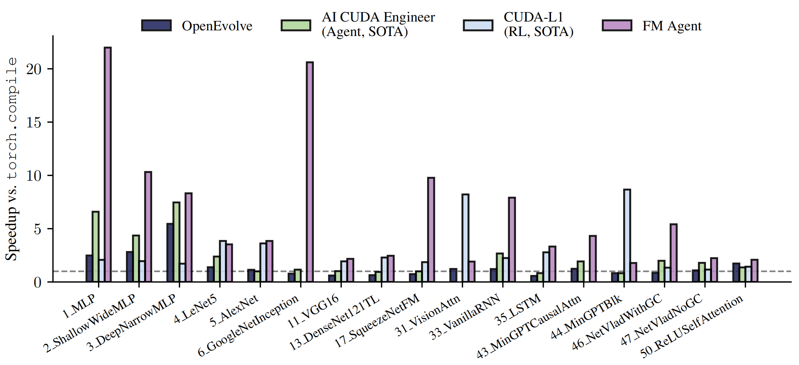

<div align="right">
  <b>简体中文</b> | <a href="README.md">English</a>
</div>

<h1 align="center">FM Agent</h1>

<div align="center">

🚩 <a href="https://cloud.baidu.com/product/famou.html" style="vertical-align:middle;"> **官方网址**</a> |
📄 **技术报告](https://github.com/baidubce/FM-Agent/blob/main/docs/FMAgent_TechReport.pdf)** |
📌  <a href="https://arxiv.org/pdf/2510.26144" style="vertical-align:middle;"> **Arxiv 链接**</a> |
<a href="https://cloud.baidu.com/" style="vertical-align:middle;"> **百度智能云**</a>

</div>


<p align="center">
  
</p>
 
## 论文简介
FM Agent 是一种新颖的、通用的多智能体框架，它通过协同结合大语言模型驱动的推理和大规模进化搜索来解决复杂的现实世界难题。我们的系统展现出广泛的适用性，已在包括运筹学、机器学习、GPU 内核优化和经典数学问题在内的各种领域进行了评估。


## 技术优势
### ❄️ 冷启动初始化
这个阶段整合了多种生成智能体，旨在产生一个广泛且高质量的初始解空间。此外，借助一个可选的 expert-in-the-loop 设计，该框架确保了进化搜索从一个具有实用基础的起点开始，这在某些现实世界的复杂案例中能显著加速收敛。

### 🧬 自适应多样性驱动采样
我们新颖的采样策略协调多个并行进化岛，通过动态资源分配自适应地平衡探索与利用。该机制在算法谱系中保持了富有成效的多样性，同时系统地引导种群趋向全局最优。

### 🎯 领域特定评估
自定义评估器综合了多个关键标准——包括功能正确性、操作有效性和LLM 监督的质量评估——以生成细致入微、多维度的反馈。这种全面的评分机制提供了丰富且累积的信号，能够精确指导迭代优化过程。

### 🚀 分布式异步基础设施
我们的可扩展编排框架基于 Ray 构建，支持在分布式计算资源上进行细粒度、大规模的并发评估。这种架构确保了高效的资源利用，同时促进了对复杂、高维解空间的快速而系统的探索。
  
## 性能指标
FM Agent 在无人为干预或调优的情况下，自主达到了最先进的结果：在 ALE-Bench 上达到 **1976.3** (+5.2%)，在 MLE-bench 上达到 **43.56**% (+4.0pp)，在 KernelBench 上实现了高达 **20×** 的加速，并在多个经典数学问题上建立了新的最先进结果。

### MLE-bench
💥💥💥FM Agent is currently ranked first on the [MLE-bench Leaderboard](https://github.com/openai/mle-bench?tab=readme-ov-file).
<p align="center">
  
</p>


### ALE-Bench
<p align="center">
  
</p>


### KernelBench
<p align="center">
  
</p>

## 引用

如果您在研究中使用了FM Agent，请引用：

```bibtex
@misc{li2025fmagent,
      title={The FM Agent}, 
      author={Annan Li and Chufan Wu and Zengle Ge and Yee Hin Chong and Zhinan Hou and Lizhe Cao and Cheng Ju and Jianmin Wu and Huaiming Li and Haobo Zhang and Shenghao Feng and Mo Zhao and Fengzhi Qiu and Rui Yang and Mengmeng Zhang and Wenyi Zhu and Yingying Sun and Quan Sun and Shunhao Yan and Danyu Liu and Dawei Yin and Dou Shen},
      year={2025},
      eprint={2510.26144},
      archivePrefix={arXiv},
      primaryClass={cs.AI},
      url={https://arxiv.org/abs/2510.26144}, 
}
```

## 许可证

本项目遵循 MIT 许可证。详见 [LICENSE](LICENSE) 文件。

## 联系我们

- GitHub Issues: [提交问题](https://github.com/baidubce/FM-Agent/issues)

---

